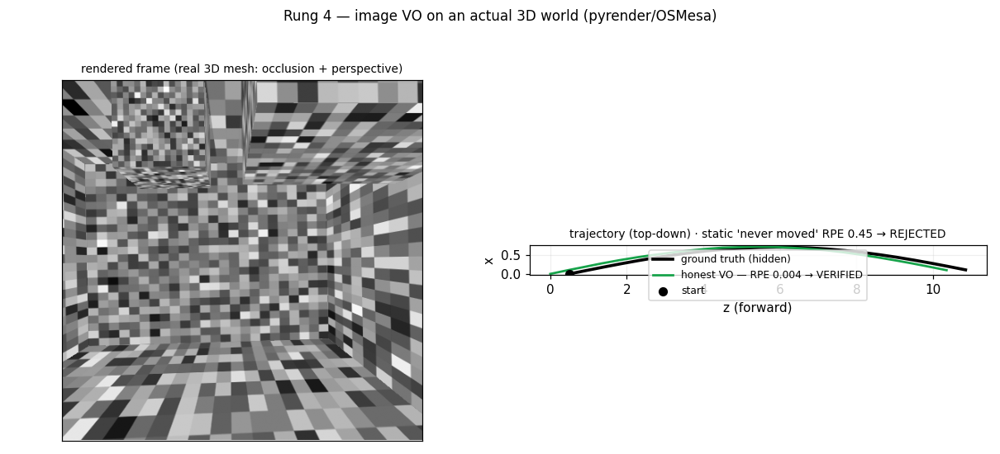
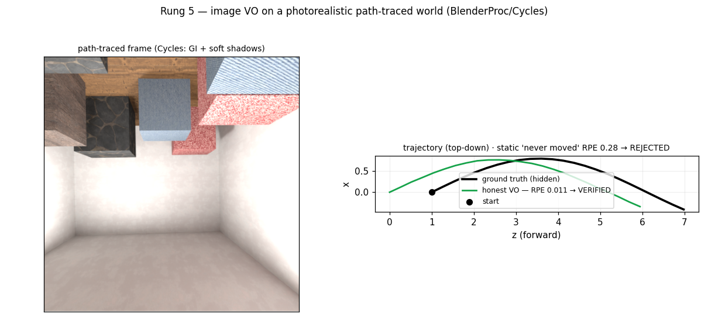
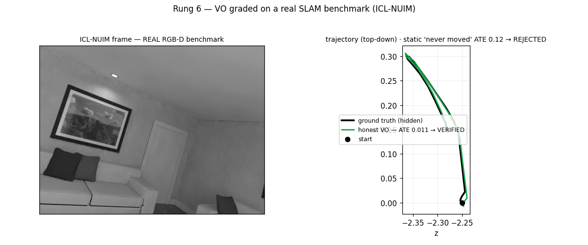

# Lodestar — a 3D testbed that *verifies* SLAM

[](https://github.com/WhaSukGO/lodestar/actions/workflows/ci.yml)
[](LICENSE)


> A lodestar guides a ship by a fixed reference; this one grades a SLAM algorithm against a
> fixed, hidden ground truth.

**Grade a SLAM algorithm on a trajectory it never saw.** SLAM always outputs *a* trajectory —
whether it's **correct** can't be known without ground truth you can't cheaply get in the real
world. A synthetic world gives perfect ground truth for free, so an estimate is scored on a
**held-out** trajectory. The honest solver lands on it (green → VERIFIED); a degenerate one
that merely *runs* drifts off (red → REJECTED):


Concretely, Lodestar is a **ground-truth generator + geometric oracle**: it builds worlds across
a fidelity ladder — pose-graphs, RGBD feature tracks, looping scenes, offscreen-rendered 3D
rooms, **photorealistic path-traced renders**, and even **real SLAM benchmark data** (ICL-NUIM)
— runs your algorithm in a sandbox, and scores its trajectory against the hidden ground truth
with **ATE / RPE**. "It produced a trajectory" is never mistaken for "the trajectory is correct."

This repo is the **world builder + SLAM oracle**. The **verifier is reused, not forked** —
it's the same Touchstone spine from [`blueberry_ver2`](../blueberry_ver2) (sandboxed run +
held-out grading + anti-tamper grader restoration). The whole thesis: *swap the
solver/domain, keep the verifier.*

```
SOLVER (swappable)                         VERIFIER (ver2 spine, the constant)
a SLAM algorithm: optimize the      -->    run it in a sandbox, align the estimate to the
graph / VO / full SLAM                     HIDDEN ground-truth trajectory, score ATE, gate
```

## Quickstart

Lodestar reuses the **Touchstone** verifier — clone both repos as siblings, then run the
offline suite (no API spend, CPU only):

```bash
git clone https://github.com/WhaSukGO/touchstone.git
git clone https://github.com/WhaSukGO/lodestar.git
pip install numpy scipy matplotlib opencv-python-headless pytest pyyaml
# opencv: Rung 3 (image-based) · pyyaml: Touchstone's image_registry
# (+ claude-agent-sdk only for the live committee demo)
# Optional, real-world-environment rungs (each auto-skips if its deps are absent):
#   Rung 4 (mesh render):  pip install pyrender trimesh  + an OSMesa lib (conda: `conda install
#                          -c conda-forge mesalib`; apt: `libosmesa6`)
#   Rung 5 (path-traced):  pip install blenderproc  (ships its own Blender; CPU/CUDA, no EGL)
#   Rung 6 (real dataset): nothing extra — auto-downloads ICL-NUIM (~700 MB) to ~/.cache/lodestar
cd lodestar && python -m pytest -q                # Rungs 0-3 through the real verifier (4-6 if deps present)
python -m lodestar.run_suite                      # robustness table across environments
python -m lodestar.run_viz                        # regenerate the preview images
```

`lodestar/_spine.py` finds Touchstone automatically when it sits at `../touchstone`, or set
`$TOUCHSTONE_PATH` to point anywhere. The verifier is the constant; Lodestar is the domain.

**Docs:** [docs/DESIGN.md](docs/DESIGN.md) — architecture, the verifier path, what each rung
is. [docs/ENGINEERING.md](docs/ENGINEERING.md) — harness-engineering principles, the past
failures that shaped them, and the geometry/numerics tradeoffs taken.

## Preview — what the verifier sees

The verdict is decided by a held-out number (ATE/RPE), but the picture shows *why*: drift
accumulates, and loop closure pulls it back. (`python -m lodestar.run_viz`)

| Rung 0 — 2D pose-graph | Rung 1 — RGBD VO | Rung 2 — full SLAM |
|---|---|---|
|  |  |  |

Green (honest) lands on the hidden ground truth → VERIFIED; red (degenerate) drifts off →
REJECTED. The plots are an inspection tool only — grading is still the independent oracle, not
eyeballing.

## Rung 0 (done): "the popcount of SLAM" — 2D pose-graph optimization

No renderer, no ML, pure numpy. A robot drives a self-overlapping 2D path; the solver gets
a pose graph (drifted odometry + loop-closure constraints) and must recover the trajectory.
The verifier grades it against the **hidden** ground-truth trajectory via SE(2)-aligned
**Absolute Trajectory Error (ATE)**.

| Solver | ATE (hidden GT) | Verdict |
|---|---|---|
| Honest pose-graph optimization (Gauss-Newton, uses loop closures) | **0.06 m** | VERIFIED |
| Alternative impl — sparse scipy (`solvers/posegraph_scipy.py`) | **0.06 m** | VERIFIED |
| Dead-reckoning (odometry only, ignores closures) | **0.28 m** | REJECTED |

Both *ran* and produced a trajectory; only the ones that actually cancel drift pass — and a
*different* correct implementation (sparse scipy) is graded the same way.
**It ran ≠ it's correct.** Held-out worlds (other seeds the producer never authored
against) are how overfitting to one sequence gets caught.

```bash
python -m lodestar.run_posegraph_demo      # offline, no API spend
python -m pytest tests/ -q
```

## Rung 1 (done): RGBD visual odometry — the SLAM front-end

Still no renderer, no ML, pure numpy. A camera flies through a cloud of 3D landmarks; each
frame yields RGBD feature observations `[landmark_id, u, v, depth]` (a shared `landmark_id`
is a track). The solver back-projects pixels+depth to 3D, matches tracks between consecutive
frames, estimates each frame-to-frame rigid motion (Procrustes/Umeyama SE(3)), and chains
them. RGBD = metric scale, so the verifier scores **Relative Pose Error (RPE)** directly
against the **hidden** ground-truth trajectory.

| Solver | RPE (hidden GT) | Verdict |
|---|---|---|
| Honest RGBD VO (Procrustes per frame pair) | **0.04 m** | VERIFIED |
| Static — "the camera never moved" (identity every frame) | **0.36 m** | REJECTED |

```bash
python -m lodestar.run_vo_demo
```

## Rung 2 (done): full visual SLAM — VO + loop closure + SE(3) pose-graph

The first complete SLAM loop, still pure numpy. It fuses the earlier rungs: Rung 1's RGBD VO
is the **front-end**, Rung 0's pose-graph optimization — now in 3D (SE(3)) — is the
**back-end**. The camera orbits a scene twice, so frames far apart in time re-observe the
same landmarks; those **loop closures** tie the trajectory together and cancel drift. The
oracle returns to global **ATE**.

| Solver | ATE (hidden GT) | Verdict |
|---|---|---|
| Full SLAM (odometry + loop closure + optimization) | **0.04 m** | VERIFIED |
| VO only — Rung 1's odometry with no loop closure | **0.17 m** | REJECTED |

Both *ran*; loop closure is **what makes SLAM more than odometry**, and the verifier
measures exactly that on a held-out trajectory.

```bash
python -m lodestar.run_slam_demo
```

## Rung 3 (done): image-based VO — features detected from pixels

The first rung where the solver gets **actual rendered frames, not feature tracks**. It must
do its own perception: detect keypoints (cv2 ORB), describe and **match them across frames by
appearance** (real data association — no landmark IDs), back-project matched keypoints with
depth, and fit SE(3) motion. The "renderer" is deliberately minimal — a procedural patch-splat
rasterizer, not Habitat/Blender — but it produces images with genuine, matchable features.

| Solver | RPE (hidden GT) | Verdict |
|---|---|---|
| Honest image VO (ORB detect + match + depth back-projection) | **0.01 m** | VERIFIED |
| Static — "the camera never moved" | **0.30 m** | REJECTED |

```bash
python -m lodestar.run_image_slam_demo     # needs opencv (cv2)
```

## Rung 4 (done): an *actual* 3D world — a real mesh scene, offscreen-rendered

Rung 3's "renderer" cheated: each feature was a camera-facing texture splat — a flat billboard
that never occludes anything and never perspective-warps. Rung 4 renders a **genuine 3D scene**
with a real GL rasterizer (**pyrender** on **OSMesa** — software, CPU-only, no GPU/display): a
textured room with boxes standing inside it. Now near surfaces **truly occlude** far ones, walls
**foreshorten** with viewing angle, and features appear/disappear as the camera moves — i.e.
real, hard data association.



The payoff for the two-layer thesis: **the solver is unchanged.** Rung 4 emits the exact same
`frames.npz` contract as Rung 3 (grayscale + metric depth + intrinsics), so the *very same* ORB
detect+match+back-project+Procrustes front-end is graded here on a real 3D world — and "the
camera never moved" is still REJECTED. Same verifier, same solver, harder world.

| Solver | RPE (hidden GT) | Verdict |
|---|---|---|
| Honest image VO (ORB on real rendered geometry) | **0.004 m** | VERIFIED |
| Static — "the camera never moved" | **0.45 m** | REJECTED |

Rendering is **host-side** (it happens in the dataset provider, not the sandbox): only world
*generation* needs pyrender; the solver sandbox still needs nothing but numpy + cv2. The renderer
is reused as a *world*, not as part of grading — the held-out RPE oracle is unchanged.

```bash
python -m lodestar.run_mesh_slam_demo      # needs pyrender + trimesh + OSMesa (see Quickstart)
```

## Rung 5 (done): a *photorealistic* world — path-traced with BlenderProc / Cycles

Rung 4's rasterizer gives flat shading and hard edges. Rung 5 renders the world with Blender's
**Cycles path tracer** (via **BlenderProc**): real **global illumination, soft shadows**, and
inter-reflections on a textured PBR room (wood floor, plaster walls, furniture) — the lighting a
real camera sees. Crucially, Cycles renders on **CPU or CUDA-compute**, so it needs **no
OpenGL/EGL display** — the same constraint that rules out GPU pyrender, Habitat, Isaac and CARLA
on a headless box.



Same two-layer payoff, harder pixels: the world emits the identical `frames.npz` contract, so the
**unchanged** ORB solver is graded on a path-traced render. Honest VO is VERIFIED; "the camera
never moved" is REJECTED.

| Solver | RPE (hidden GT) | Verdict |
|---|---|---|
| Honest image VO (ORB on the path-traced render) | **0.005 m** | VERIFIED |
| Static — "the camera never moved" | **0.28 m** | REJECTED |

Rendering is host-side and out-of-process (`blenderproc run` from the dataset provider); the
solver sandbox still needs only numpy + cv2. BlenderProc ships its own Blender, so `pip install
blenderproc` is all the world-generation needs.

```bash
python -m lodestar.run_blender_slam_demo   # needs blenderproc (pip install blenderproc)
```

## Rung 6 (done): the toy-to-real step — VO on a *real SLAM benchmark* (ICL-NUIM)

The previous rungs build their own worlds. This one takes the opposite, most-robust route: a
real, widely-cited RGB-D SLAM benchmark — **ICL-NUIM** (Handa et al.) — *is* the world.
Photorealistic ray-traced frames + metric depth + a perfect ground-truth camera trajectory that
the SLAM community actually benchmarks on. We hold the trajectory out and grade the same ORB
solver on it. Real data, zero render risk.



ICL-NUIM moves only ~6.5 m over 1508 frames, so per-frame RPE can't separate honest VO from "the
camera never moved" — but **ATE** can: a static solver collapses to a single point while the
ground truth sweeps the room. So this rung grades on the SE(3)-aligned **ATE** oracle.

| Solver | ATE (hidden GT) | Verdict |
|---|---|---|
| Honest image VO (ORB on the real sequence) | **0.011 m** | VERIFIED |
| Static — "the camera never moved" | **0.12 m** | REJECTED |

This closes the loop from synthetic worlds to data a real SLAM system is measured on — the
verifier and solver are unchanged, only the world is now real. The dataset (~700 MB) is
auto-downloaded and cached to `~/.cache/lodestar` on first run.

```bash
python -m lodestar.run_icl_slam_demo       # downloads ICL-NUIM (~700 MB) on first run
```

## Selectable environments — a robustness suite

Each rung's world is parameterized (noise, loop-closure density, landmark count, trajectory
shape) with named presets. The suite grades **one solver across many environments** under the
**same fixed oracle** — so the question becomes "does the honest algorithm still pass when the
world gets harder?" (`python -m lodestar.run_suite`)

```
=== Rung 0 — 2D pose-graph | honest solver | oracle ate <= 0.12 ===
  scenario           ate   verdict
  easy             0.033   VERIFIED
  default          0.062   VERIFIED
  high-noise       0.152   REJECTED     # loops help, but not beyond a point
  no-loops         0.280   REJECTED     # no revisits -> drift uncorrectable
```

The honest solver is **not** rubber-stamped: remove the loop closures and the very same
pose-graph optimizer is correctly REJECTED. (Rung 1 stays robust to sparse landmarks; Rung 2
fails a single-pass `no-loops` world for the same reason as Rung 0.) This is how a real
benchmark works — many scenarios — and how overfitting to one world gets caught.

The Rung 0 grid is shown at the top of this README; `python -m lodestar.run_viz` also writes
the Rung 1 and Rung 2 robustness grids into `docs/img/`.

## Roadmap (rung by rung — start cheap, add fidelity only when each rung holds)

| Rung | Task | Input | Oracle | Deps |
|---|---|---|---|---|
| **0 ✅** | 2D pose-graph optimization | constraint graph | ATE | numpy |
| **1 ✅** | RGBD visual odometry | synthetic feature tracks | RPE | numpy |
| **2 ✅** | full visual SLAM + loop closure | feature tracks + revisits | ATE | numpy |
| **3 ✅** | image-based VO (features from pixels) | billboard-rendered RGBD | RPE | numpy + opencv |
| **4 ✅** | image VO on a real 3D mesh world | offscreen-rendered 3D scene | RPE | + pyrender/OSMesa |
| **5 ✅** | image VO on a photorealistic world | path-traced render (GI + shadows) | RPE | + blenderproc |
| **6 ✅** | VO on a real SLAM benchmark | ICL-NUIM RGB-D dataset | ATE | + dataset (~700 MB) |

## Rendering backends & the headless-GPU constraint

Generating real-world-like worlds needs a renderer that produces RGB + metric depth + ground-truth
poses **without an OpenGL/EGL display** (a headless box — e.g. WSL2 with no `/dev/dri` — can't
create EGL contexts, even with a CUDA GPU present). That single constraint decides what's usable:

| Backend | Renders via | Works headless here? | Used by |
|---|---|---|---|
| **pyrender + OSMesa** | software GL (CPU) | ✅ | Rung 4 |
| **BlenderProc / Cycles** | CPU or **CUDA-compute** (no EGL) | ✅ | Rung 5 |
| **ICL-NUIM dataset** | pre-rendered (no renderer) | ✅ | Rung 6 |
| **nvdiffrast** `RasterizeCudaContext` | **CUDA-compute** (no EGL) | ✅ (proven in Docker) | `docker/` spike |
| Habitat-Sim / Isaac Sim / CARLA | EGL / Vulkan **display** | ❌ (no headless EGL) | — |

The lesson: prefer renderers that go through **CUDA-compute or software**, not a GL/Vulkan display.
`docker/run_nvdiffrast_spike.sh` proves EGL-free GPU rasterization works inside a GPU container
(`--gpus all` + NVIDIA Container Toolkit), with hang-safe patterns (`--rm`, `--name`, `timeout`)
since GPU containers can stall on context creation. Habitat/Isaac/CARLA were evaluated and ruled
out on this hardware: their headless paths still require an EGL/Vulkan display.

## Live: a committee of agents as the solver (done)

The highlight of the two-layer model — the verifier and domain are unchanged; only the
**solver** is swapped from canned reference code to a real multi-agent team (ver2's
`code_committee`: PLANNER → CODER → REVIEWER, each a live Claude session). The committee
authors the algorithm **blind** (it reasons and writes code; it does not execute it), and the
verifier grades the result on the hidden trajectory.

| Solver | Rung | Metric (hidden GT) | Verdict |
|---|---|---|---|
| Live committee (PLANNER→CODER→REVIEWER) | 1 (RGBD VO) | RPE **0.122** | VERIFIED |

A real agent team authored working visual odometry (a 198-line solution, reviewer-approved),
confirmed on data it never saw — ~3 API calls, ≈\$0.78. An agent solver still gets **no free
pass**: it is graded by the same fixed verifier as everything else.

```bash
python -m lodestar.run_committee_live --rung 1     # spends API tokens; key from Touchstone's .env
```

(The solver runs under a `timeout` guard so blind-authored code that loops is rejected, not
hung.) This live demo is **optional** — it additionally needs the `code_committee` solver from
Touchstone's `coding-solver` branch and an `ANTHROPIC_API_KEY`. The offline rungs, suite, and
viz need only Touchstone's `master`.

## Reuse

`lodestar/_spine.py` locates the ver2 checkout (`$TOUCHSTONE_PATH`, else `../blueberry_ver2`)
and re-exports the seam ver4 plugs into: `build_implementer_harness`, `ImplementationTask`,
`DatasetRef`. The pose-graph world is just a richer `DatasetProvider`; the SLAM algorithm is
the swappable `author_fn`; the ATE grader is the task's fixed `eval_code`.
